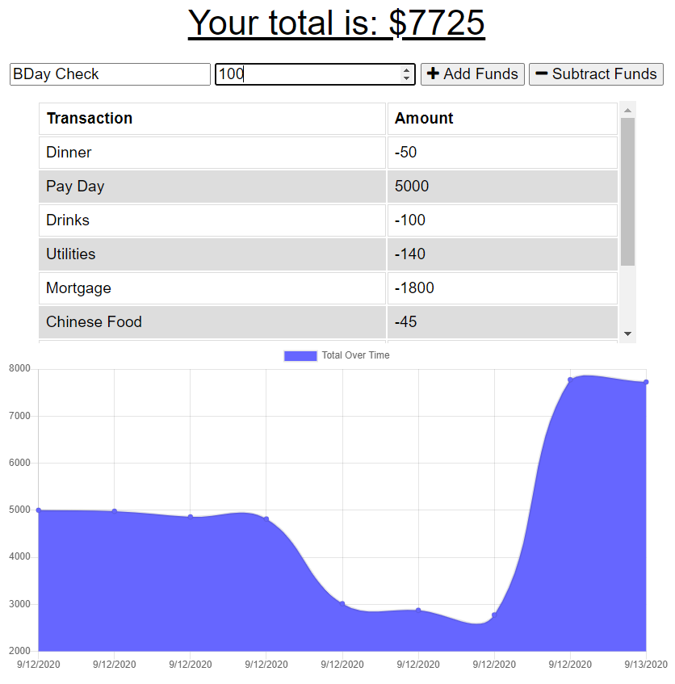
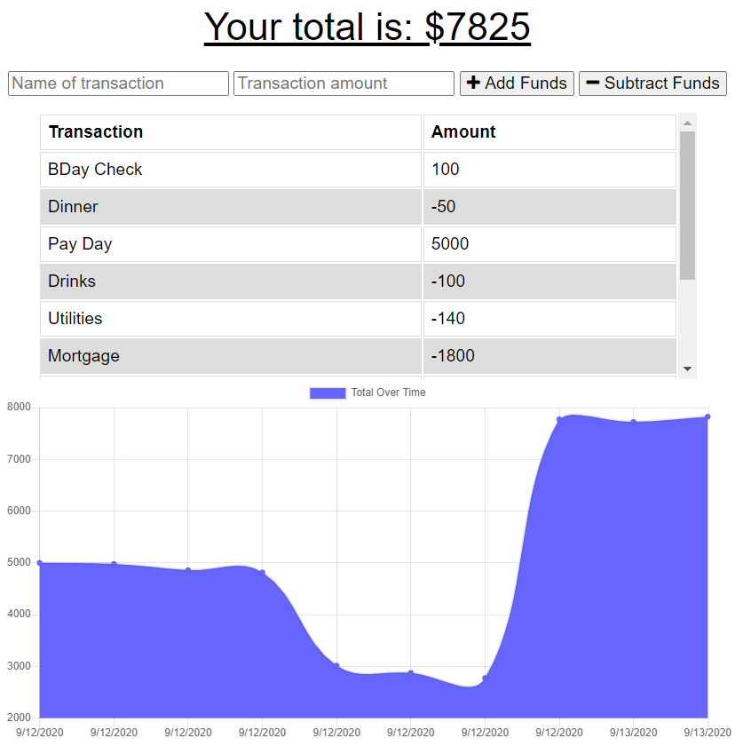
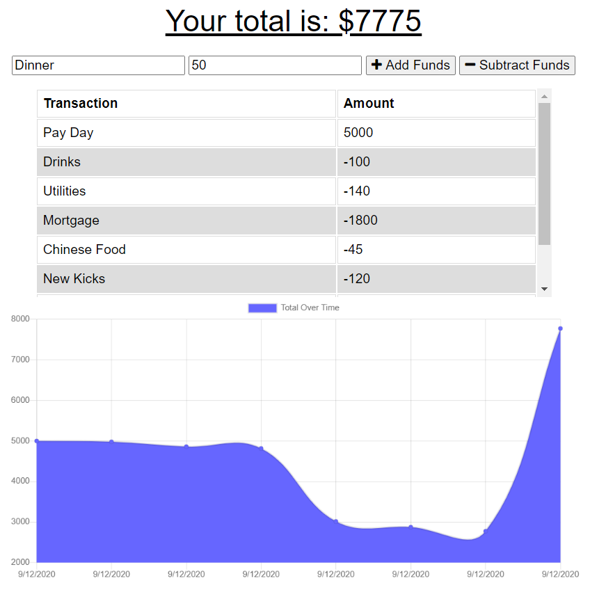
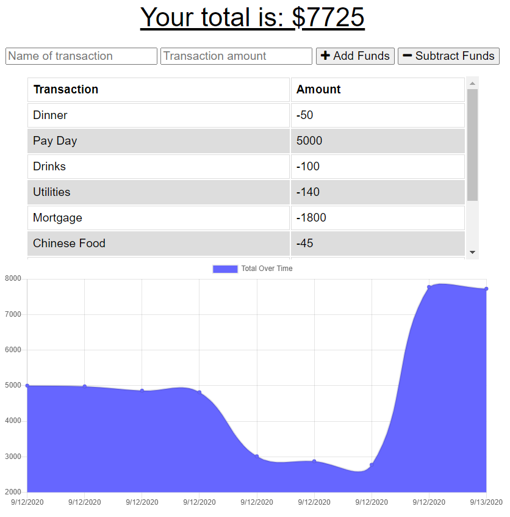
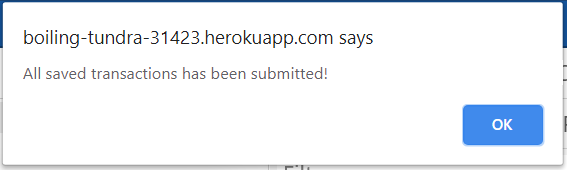

# Budget Tracker

## TABLE OF CONTENTS    
[1. TABLE OF CONTENTS](#TABLE-OF-CONTENTS)    
[2. DESCRIPTION](#DESCRIPTION)  
[3. APPLICATION LINKS](#APPLICATION-LINKS)  
[4. CONTRIBUTORS](#CONTRIBUTORS)  
[5. DEPENDENCIES](#DEPENDENCIES)  
[6. INSTALLATION](#INSTALLATION)   
[7. USAGE](#USAGE)   
[8. TESTING](#TESTING)  
[9. FUNCTIONALITY](#FUNCTIONALITY)  

---

## DESCRIPTION
The purpose of this app is to allow a personal user to track their personal finances.  It is built to run properly with or without an internet connection so a user can track thier finances at any time.

---

## APPLICATION LINKS
[GitHub Repo](https://github.com/brandonljackson23/budget-tracker)  
[Deployed App](https://boiling-tundra-31423.herokuapp.com/)  

---

## CONTRIBUTORS   
Brandon Jackson | <brandonljackson23@gmail.com> | [github](https://github.com/brandonljackson23)  

---

## DEPENDENCIES 
This application was developed with the following application structures:  
* [Node.js](https://nodejs.org/en/)  
* [Node Package Manager (NPM)](https://www.npmjs.com/) 
    + [NPM Express](https://www.npmjs.com/package/express) 
    + [NPM Compression](https://www.npmjs.com/package/compression)  
    + [NPM Mongoose](https://www.npmjs.com/package/mongoose)  
    + [NPM Morgan](https://www.npmjs.com/package/morgan)  
* [IndexedDB](https://www.npmjs.com/search?q=IndexedDB)  

---

## INSTALLATION
To run the tool you will need to clone the project files from my GitHub page at https://github.com/brandonljackson23/budget-tracker. You will also need to install all dependencies, which are listed above.

---

## USAGE
This API is intended to be used by any user who wishes to track their personal finances.

---

## TESTING
All tests were ran on the using Google Chrome's Dev Tools to test the functionality of the features set and to test offline functionality. 

---

## FUNCTIONALITY  
A user can add funds to their account by entering a transaction name and transaction amount and clicking on Add Funds:

The transaction is then added to the table and to the graph below:

A user can also remove funds from their account by entering a transaction name an transaction amount and clicking Subtract Funds:

The transaction is then added to the table and to the graph below:

The app will continue to work even without an internet connection by storing transactions locally and then uploading them once a connection is reestablished.

